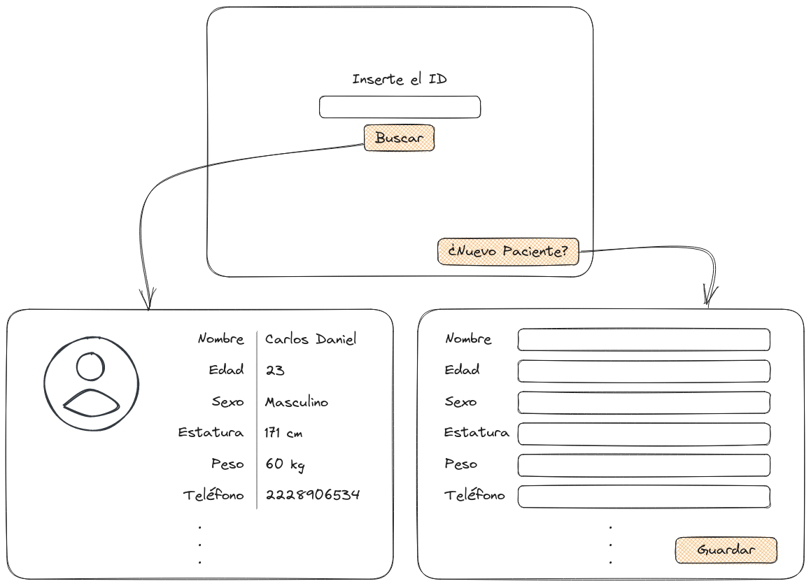

# T: Requerimientos

## Problema

Almacenamiento de historial clínico en físico.

---

## Requerimientos

- Respaldo digital de la información.
- expediente clínico.
- Evitar el extravío y/o duplicación de la información.

Método de Almacenamiento: Por registros.

---

## Datos a Solicitar

- ID
- Nombre
- Edad
- Sexo
- Estatura
- Peso
- Dirección
- Teléfono
- Segundo Teléfono
- Correo Electrónico
- Motivo de Consulta
- Alergias
- Enfermedades Crónicas
- Tipo de Sangre
- Presión Sanguínea
- Pulsaciones por Minuto
- Oxigenación

---

## Posible Interfaz

 

---
