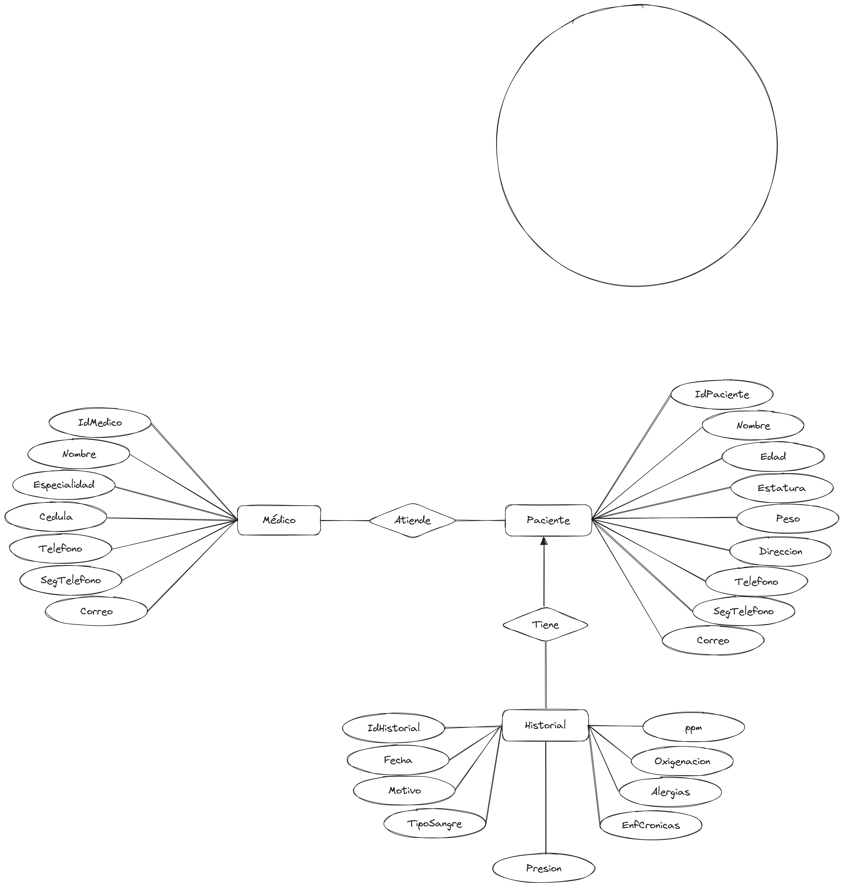

# Proyecto Fase 2 - Diseño del DD y Modelo Conceptual

## Entidad Paciente

Atributo    | longitud | Tipo de Dato | Nulo | Compuesto | Multivaluado | Restricciones
------------|----------|--------------|------|-----------|--------------|---------------
IdPaciente  | 8        | Entero       | No   | No        | -            | Llave primaria
Nombre      | 30       | Cadena       | No   | No        | -            | 
Edad        | -        | Entero       | No   | No        | -            | 
Estatura    | -        | Entero       | No   | No        | -            |
Peso        | -        | Flotante     | No   | No        | -            |
Direccion   | 30       | Cadena       | No   | No        | -            |
Telefono    | 13       | Cadena       | No   | No        | -            |
SegTelefono | 13       | Cadena       | No   | No        | -            |
Correo      | 20       | Cadena       | No   | No        | -            |

## Entidad Medico

Atributo     | longitud | Tipo de Dato | Nulo | Compuesto | Multivaluado | Restricciones
-------------|----------|--------------|------|-----------|--------------|--------------
IdMedico     | 8        | Entero       | No   | No        | -            | Llave primaria
Nombre       | 30       | Cadena       | No   | No        | -            | 
Especialidad | 30       | Cadena       | No   | No        | -            | 
Cedula       | -        | Entero       | No   | No        | -            | 
Telefono     | 13       | Cadena       | No   | No        | -            |
SegTelefono  | 13       | Cadena       | No   | No        | -            |
Correo       | 20       | Cadena       | No   | No        | -            |

## Entidad Historial

Atributo    | longitud | Tipo de Dato | Nulo | Compuesto | Multivaluado | Restricciones
------------|----------|--------------|------|-----------|--------------|--------------
IdHistorial | 8        | Entero       | No   | No        | -            | Llave primaria
Fecha       | 10       | String       | No   | No        | -            | 
Motivo      | 300      | String       | No   | No        | -            |
TipoSangre  | 4        | Cadena       | No   | No        | -            |
Presion     | -        | Flotante     | No   | No        | -            | 
ppm         | -        | Entero       | No   | No        | -            | 
Oxigenacion | -        | Flotante     | No   | No        | -            | 
Alergias    | -        | Cadena       | No   | No        | Si           |
EnfCronicas | -        | Cadena       | No   | No        | Si           |

### Restricciones y Reglas

### Relaciones

Un médico puede tener varios pacientes y un paciente puede tener varios médicos

## Modelo Entidad

 
